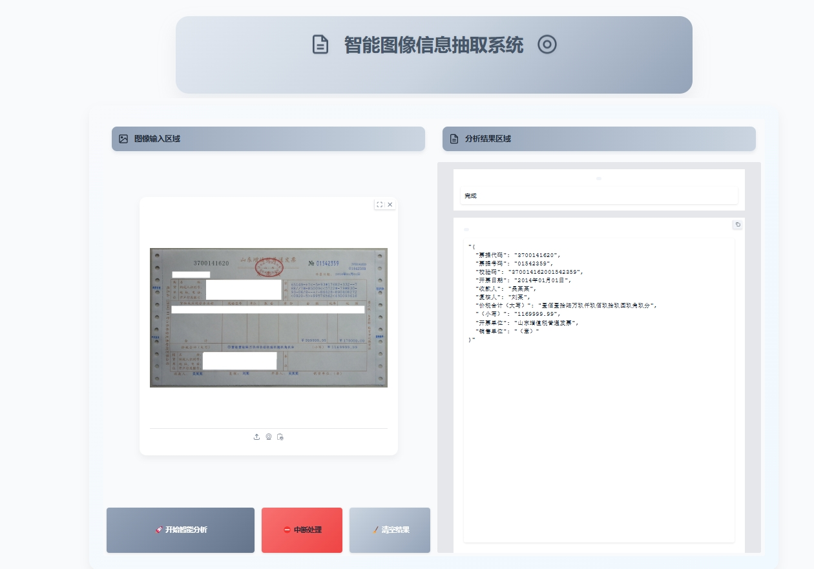

# 智能图像信息抽取系统

基于Qwen2.5-VL大模型的智能图像信息抽取系统，可以自动从图片中提取关键信息并以结构化的方式输出。

## 功能特点

- 支持多种文档类型的信息抽取
- 基于Qwen2.5-VL大模型的视觉语言理解能力
- 使用LoRA技术进行高效微调
- 提供友好的Web界面
- 支持批量处理和实时预览

## 环境要求

- Python 3.8+
- CUDA 11.7+
- PyTorch 2.0+
- Transformers 4.36+

## 快速开始

### 1. 安装

```bash
# 克隆项目
git clone https://github.com/yourusername/kie_qwen25vl.git
cd kie_qwen25vl

# 安装依赖
pip install -r requirements.txt
```

### 2. 数据准备

将训练数据放置在 `data/train/` 目录下，评估数据放置在 `data/eval/` 目录下。

### 3. 模型训练

```bash
python src/train.py --config configs/kie_config.py
```

### 4. 启动Web服务

```bash
python src/app.py
```

访问 http://localhost:7860 即可使用Web界面。

### Web界面预览



系统提供了直观的Web操作界面，支持图片上传、实时预测和结果展示。

## 配置说明

在 `configs/kie_config.py` 中可以配置以下参数：

### 模型配置
- model_name: 基础模型路径
- max_seq_length: 最大序列长度
- load_in_4bit: 是否使用4bit量化

### LoRA配置
- lora_r: LoRA rank
- lora_alpha: LoRA alpha
- lora_dropout: LoRA dropout

### 训练配置
- learning_rate: 学习率
- batch_size: 批次大小
- num_epochs: 训练轮数
- warmup_steps: 预热步数

### 路径配置
- train_data_path: 训练数据路径
- eval_data_path: 评估数据路径
- model_save_path: 模型保存路径

## 开发计划

- [ ] 支持更多文档类型（发票、合同等）
- [ ] 优化数据预处理流程
- [ ] 添加数据增强方法
- [ ] 实现分布式训练
- [ ] 添加模型量化功能
- [ ] 优化推理速度
- [ ] 完善评估指标


## 许可证

本项目采用 MIT 许可证。详见 [LICENSE](LICENSE) 文件。

## 联系方式

如有问题或建议，欢迎提交 Issue 或 Pull Request。